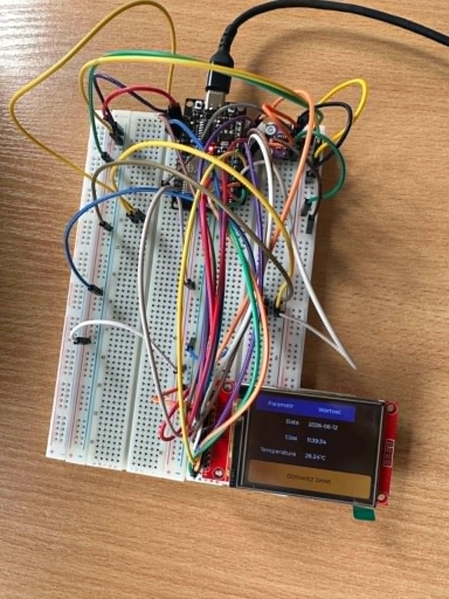
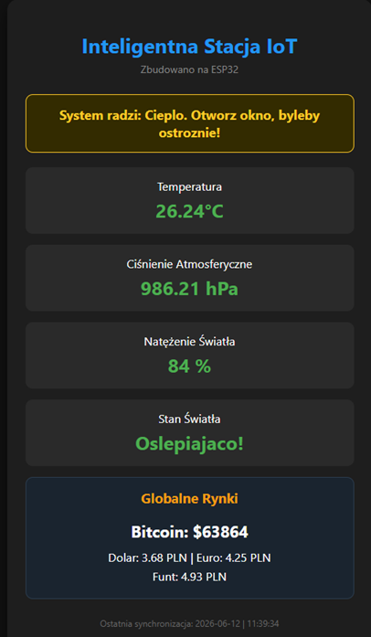
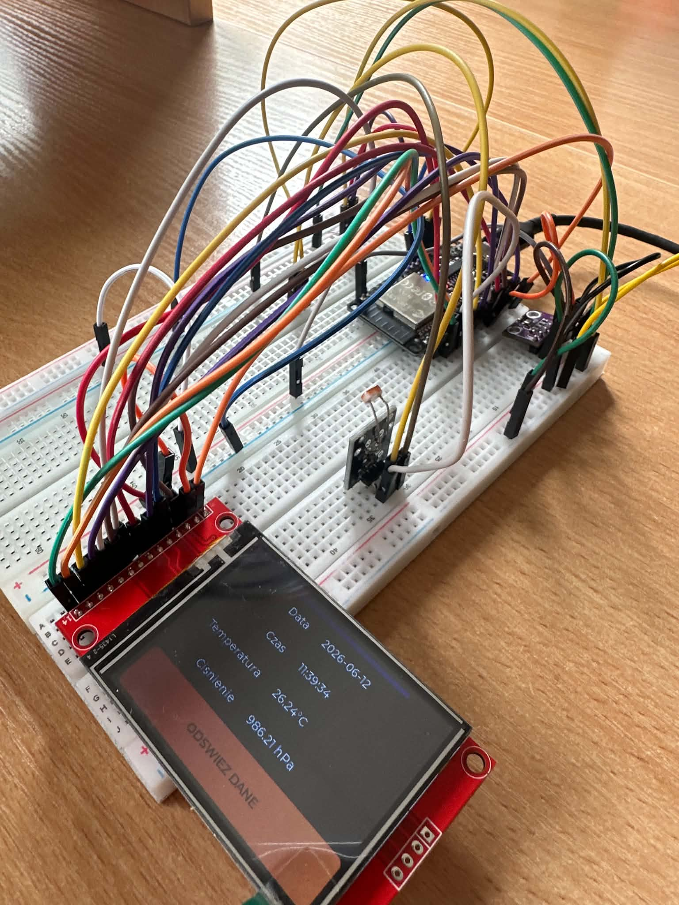

# Autonomiczny Terminal IoT i Internetowy Dashboard Środowiskowy

## 1. Opis projektu

Projekt przedstawia implementację dedykowanego terminala Internetu Rzeczy (IoT) opartego na mikrokontrolerze ESP32. Urządzenie realizuje jednoczesne zadania z zakresu akwizycji danych sensorycznych, asynchronicznej komunikacji sieciowej z zewnętrznymi interfejsami API oraz renderowania zaawansowanego interfejsu graficznego użytkownika (GUI).

System wyróżnia się architekturą nieblokującą – przetwarzanie procesów sieciowych (klient HTTP, serwer HTTP, synchronizacja czasu NTP) odbywa się w tle, zapewniając pełną responsywność lokalnego ekranu dotykowego oraz płynność działania systemów czasu rzeczywistego.

---

## 2. Architektura systemu i kluczowe funkcjonalności

### Interfejs graficzny urządzenia (TFT GUI)

Lokalny interfejs użytkownika został zbudowany w oparciu o bibliotekę LVGL (v9.x). Dane prezentowane są w ustrukturyzowanej tabeli parametrów z implementacją dynamicznego systemu modyfikacji motywu wizualnego. Kolorystyka nagłówków oraz wierszy parzystych dostosowuje się automatycznie do aktualnej temperatury otoczenia.

<p align="center">
  
</p>

### Asynchroniczny serwer HTTP i interfejs webowy

Urządzenie uruchamia niezależny serwer WWW na porcie 80. Po wpisaniu adresu IP urządzenia w sieci lokalnej ESP32 dynamicznie generuje i serwuje responsywną stronę HTML/CSS w trybie Dark Mode. Pozwala to na podgląd parametrów stacji z poziomu dowolnego urządzenia mobilnego bez wpływu na działanie lokalnego GUI.

<p align="center">
  
</p>

## 3. Specyfikacja sprzętowa i połączenia (Pinout)

Urządzenie wykorzystuje mikrokontroler ESP32 oraz komunikację za pomocą magistral SPI i I2C. Kontroler dotyku został odseparowany na dedykowany kanał HSPI w celu wyeliminowania konfliktów transmisji.

<p align="center">
  
</p>


### Wykaz połączeń interfejsów sprzętowych

| Komponent peryferyjny | Pin ESP32 | Typ magistrali / Funkcja | Specyfikacja      |
| --------------------- | :-------: | :----------------------: | ----------------- |
| BMP280 SDA            |    `27`   |        I2C (Dane)        | Adres 0x76        |
| BMP280 SCL            |    `22`   |        I2C (Zegar)       | 100 kHz           |
| Fotorezystor LDR      |    `34`   |           ADC1           | Pomiar napięcia   |
| XPT2046 CLK           |    `25`   |           HSPI           | Linia zegarowa    |
| XPT2046 MISO          |    `39`   |           HSPI           | Odczyt danych     |
| XPT2046 MOSI          |    `32`   |           HSPI           | Wysyłanie komend  |
| XPT2046 CS            |    `33`   |           HSPI           | Chip Select       |
| XPT2046 IRQ           |    `36`   |        Przerwanie        | Wykrywanie dotyku |

---

## 4. Implementacja programistyczna i kalibracja

### Kalibracja czujnika LDR

W celu uzyskania poprawnej interpretacji poziomu oświetlenia zastosowano własną funkcję mapowania wartości ADC:

```cpp
int ldr_raw = analogRead(LDR_PIN);

int light_percent = map(ldr_raw, 1500, 200, 0, 100);

light_percent = constrain(light_percent, 0, 100);
```

Dzięki kalibracji system rozpoznaje poziomy oświetlenia takie jak ciemność, półmrok, odpowiednie oświetlenie oraz bardzo silne światło.

### Architektura pętli głównej

System wykorzystuje podejście nieblokujące, dzięki czemu GUI, serwer WWW oraz komunikacja sieciowa mogą działać równolegle.

```cpp
void loop() {
  lv_task_handler();
  lv_tick_inc(5);
  server.handleClient();

  if (WiFi.status() == WL_CONNECTED && !time_synchronized) {
    struct tm timeinfo;

    if (getLocalTime(&timeinfo, 5) && timeinfo.tm_year > 70) {
      update_table_values();
      time_synchronized = true;
    }
  }

  delay(5);
}
```

---

## 5. Wymagania środowiskowe i kompilacja

Do kompilacji projektu wymagane jest środowisko Arduino IDE wraz z rdzeniem ESP32 (v3.x). Ze względu na wykorzystanie LVGL oraz stosu sieciowego TCP/IP zalecana jest odpowiednia konfiguracja pamięci Flash.

* **Płytka:** ESP32 Dev Module (ESP32-WROOM lub kompatybilna)
* **Partition Scheme:** `Huge APP (3MB No OTA / 1MB SPIFFS)`
* **Flash Mode:** `DIO`

### Wymagane biblioteki

* `lvgl` v9.x
* `TFT_eSPI`
* `XPT2046_Touchscreen`
* `ArduinoJson` v7.x
* `Adafruit_BMP280`
